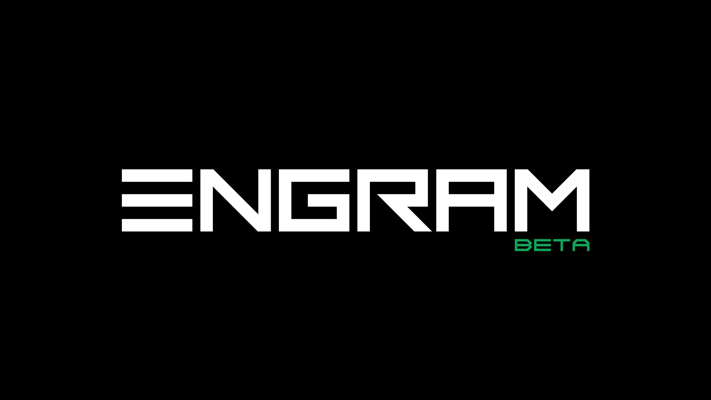

# *One Wallet. All of DERO.*

### The Engram smart wallet empowers users to easily and securely manage their money and assets on the DERO blockchain.

### Included Features
- [x]  Privately send and receive money globally
- [x]  On-chain encrypted private messaging
- [x]  Dynamically interact with smart contracts
- [x]  Native asset tracking
- [x]  Register and transfer user-friendly addresses (usernames)
- [x]  [Gnomon](https://github.com/civilware/Gnomon) integration for blockchain indexing
- [x]  Encrypted Notepad
- [x]  Websocket support for dApp/web3 connections
- [x]  Sign files using your wallet to guarantee authenticity
- [x]  Explore [TELA](https://github.com/civilware/tela) dApps and websites
- [x]  Supports [EPOCH](https://github.com/civilware/epoch) crowd mining protocol

### Upcoming Features
- [ ]  Multi-language support
- [ ]  Mobile camera support

### Watch the Beta Release Video
[](https://www.youtube.com/watch?v=00-gpNbkRW4)

## Releases
We plan to deploy releases on the following platforms:
- [x]  Windows
- [x]  Linux
- [x]  Mac OS
- [ ]  iOS
- [x]  Android

See [releases](https://github.com/DEROFDN/Engram/releases) for the latest builds.

## Development

### Using Taskfile

We provide a [Taskfile](https://taskfile.dev/) for common development tasks:

```bash
# Install task
go install github.com/go-task/task/v3/cmd/task@latest

# List available tasks
task --list

# Common tasks
task build          # Build the application
task test           # Run tests
task lint           # Run linters
task ci             # Run CI pipeline locally
task security       # Run all security checks
```

### Manual Build

<b>Required Processes</b>

Please see: https://developer.fyne.io/

You are required to have all the dependencies for Fyne installed. Specifically (if you are on windows), <b>TDM-GCC-64</b>.

* Install fyne cmd tools: `go install fyne.io/fyne/v2/cmd/fyne@latest`
* Add `~/go/bin` to your `$PATH` environment variable if not done already: `export PATH=$PATH:~/go/bin/`
* Clone Engram repository and navigate to its directory:

```
git clone https://github.com/DEROFDN/Engram.git
cd Engram
go mod tidy
```

#### Building for Windows

* Build from within the repo directory:
```
fyne package -name Engram -os windows -appVersion 0.6.5 -icon Icon.png -tags migrated_fynedo
```

#### Building for Android APK (Linux)

* Install android-sdk: `sudo apt install android-sdk`
* Download r26b android NDK - https://developer.android.com/ndk/downloads
* Add environment variable for ANDROID_NDK_HOME to point at the downloaded and extracted ndk directory
* Build from within the repo directory:
```
fyne package -name Engram -os android/arm64 -appVersion 0.6.5 -appID com.engram.main -icon ./Icon.png -tags migrated_fynedo
```

## CI/CD & Security

This project implements wallet-grade CI/CD with:
- Multi-platform builds (Linux, Windows, macOS, Android)
- Security scanning (Trivy, Gitleaks, GoSec, Semgrep)
- Conventional commit validation
- Fuzz testing for critical functions
- Supply chain security with SBOM generation

See [Security Audit](docs/SECURITY_AUDIT.md) for details.

## Contributing

Issues and pull requests are welcome, but will need to be reviewed by DERO Foundation developers.

Please follow [Conventional Commits](https://www.conventionalcommits.org/) for pull request titles.


